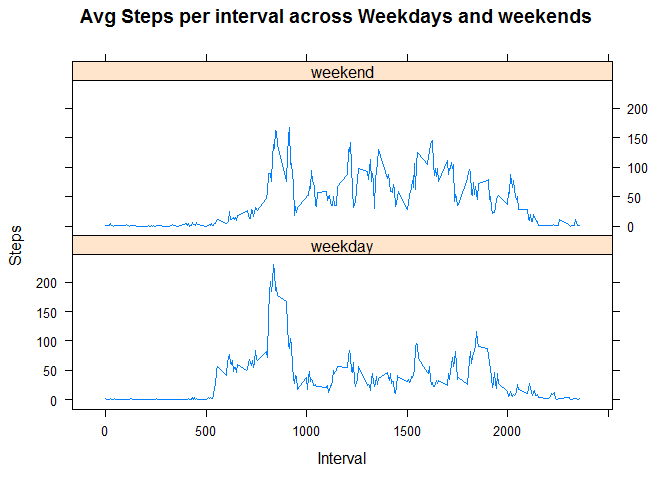

## Loading and preprocessing the data


```r
actdata <- read.csv("activity.csv")
```

# What is mean total number of steps taken per day?
For this part of the assignment, you can ignore the missing values in the dataset.


```r
daysteps <- aggregate(steps~date,actdata,sum, na.rm=TRUE)

hist(daysteps$steps,col="green",xlab="Steps",main="Total number of steps taken each day")
```

<!-- -->

## Calculate and report the mean and median of the total number of steps taken per day


```r
daymean <- mean(daysteps$steps)
daymedian <- median(daysteps$steps)
```

Mean value of total number of steps 1.0766189\times 10^{4} and Median value of total number of steps is 10765


## What is the average daily activity pattern?

1. Make a time series plot (i.e. type = "l") of the 5-minute interval (x-axis) and the average number of steps taken, averaged across all days (y-axis)


```r
inter_steps <- aggregate(steps~interval, actdata,mean,na.rm=TRUE)

plot(inter_steps$interval, inter_steps$steps, type="l",xlab = "Interval", ylab="Steps", main="Time series plot of intervals")
```

<!-- -->


2.Which 5-minute interval, on average across all the days in the dataset, contains the maximum number of steps?


```r
maxinterval <- inter_steps[inter_steps$steps==max(inter_steps$steps),1]
```

Max steps contains in the interval 835


## Imputing missing values

1.Calculate and report the total number of missing values in the dataset (i.e. the total number of rows with NAs)


```r
missingvalues <- sum(is.na(actdata))
```

Total number of missing values in the dataset is 2304

2.Devise a strategy for filling in all of the missing values in the dataset. The strategy does not need to be sophisticated. For example, you could use the mean/median for that day, or the mean for that 5-minute interval, etc.

My strategy is to use mean of 5-minute interval to impute NA values

3.Create a new dataset that is equal to the original dataset but with the missing data filled in.


```r
completedata <- actdata

for(i in 1:nrow(completedata))
{
  if(is.na(completedata$steps[i]))
  {
    interval_val <- completedata$interval[i]
    completedata$steps[i] <- inter_steps$steps[inter_steps$interval==interval_val]
  }
}
```


4.Make a histogram of the total number of steps taken each day and Calculate and report the mean and median total number of steps taken per day. Do these values differ from the estimates from the first part of the assignment? What is the impact of imputing missing data on the estimates of the total daily number of steps?


```r
daysteps_completedata <- aggregate(steps~date,completedata,sum)

hist(daysteps_completedata$steps, col="steelblue", xlab="Steps",main="Total number of steps taken each day on Imputed Data")
```

<!-- -->

```r
compmean <- mean(daysteps_completedata$steps)
compmedian <- median(daysteps_completedata$steps)
```

Mean of imputed data is 1.0766189\times 10^{4} and non-imputed data is 1.0766189\times 10^{4} and median of imputed data is 1.0766189\times 10^{4} and non-imputed data is 10765

After imputing data, median has changed

## Are there differences in activity patterns between weekdays and weekends?

For this part the weekdays() function may be of some help here. Use the dataset with the filled-in missing values for this part.

1.Create a new factor variable in the dataset with two levels - "weekday" and "weekend" indicating whether a given date is a weekday or weekend day.


```r
completedata$day <- weekdays(as.Date(completedata$date))

completedata <- within(completedata, day[!(day %in% c("Saturday","Sunday"))] <- "weekday")
completedata <- within(completedata, day[day %in% c("Saturday","Sunday")] <- "weekend")
```

2.Make a panel plot containing a time series plot (i.e. type = "l") of the 5-minute interval (x-axis) and the average number of steps taken, averaged across all weekday days or weekend days (y-axis). See the README file in the GitHub repository to see an example of what this plot should look like using simulated data.


```r
library(lattice)
daywisestepsaggregate <- aggregate(steps~interval*day,data=completedata,mean)
xyplot(steps~interval|day, data=daywisestepsaggregate,type="l",layout =c(1,2),xlab="Interval",ylab="Steps", main="Avg Steps per interval across Weekdays and weekends")
```

<!-- -->
